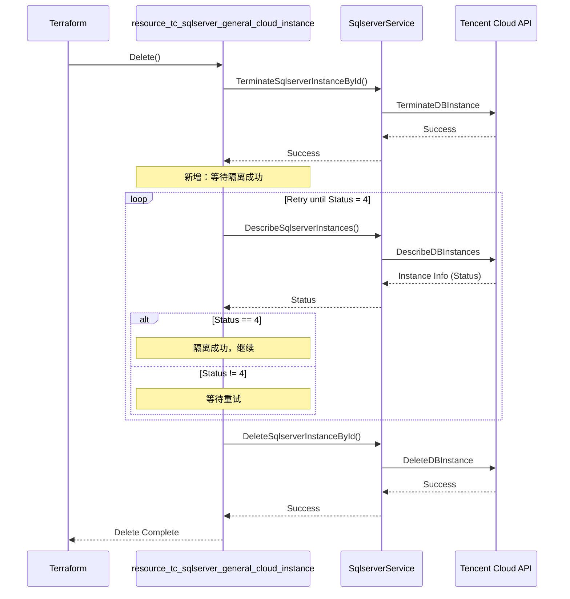

# Design: Add Isolation Wait Mechanism for SQL Server General Instance Deletion

## Architecture Overview

本次变更仅涉及 `tencentcloud_sqlserver_general_cloud_instance` 资源的删除模块，在删除流程中添加等待隔离成功的机制。

### 修改范围

```
tencentcloud/services/sqlserver/
├── resource_tc_sqlserver_general_cloud_instance.go  ← 修改 Delete 函数
└── service_tencentcloud_sqlserver.go                 ← 可能需要添加辅助方法
```

## Component Design

### 1. 删除流程改造

**文件**: `resource_tc_sqlserver_general_cloud_instance.go`

**函数**: `resourceTencentCloudSqlserverGeneralCloudInstanceDelete`

#### 当前实现（第 652-672 行）

```go
func resourceTencentCloudSqlserverGeneralCloudInstanceDelete(d *schema.ResourceData, meta interface{}) error {
	defer tccommon.LogElapsed("resource.tencentcloud_sqlserver_general_cloud_instance.delete")()
	defer tccommon.InconsistentCheck(d, meta)()

	var (
		logId      = tccommon.GetLogId(tccommon.ContextNil)
		ctx        = context.WithValue(context.TODO(), tccommon.LogIdKey, logId)
		service    = SqlserverService{client: meta.(tccommon.ProviderMeta).GetAPIV3Conn()}
		instanceId = d.Id()
	)

	if err := service.TerminateSqlserverInstanceById(ctx, instanceId); err != nil {
		return err
	}

	if err := service.DeleteSqlserverInstanceById(ctx, instanceId); err != nil {
		return err
	}

	return nil
}
```

#### 新实现（设计）

```go
func resourceTencentCloudSqlserverGeneralCloudInstanceDelete(d *schema.ResourceData, meta interface{}) error {
	defer tccommon.LogElapsed("resource.tencentcloud_sqlserver_general_cloud_instance.delete")()
	defer tccommon.InconsistentCheck(d, meta)()

	var (
		logId      = tccommon.GetLogId(tccommon.ContextNil)
		ctx        = context.WithValue(context.TODO(), tccommon.LogIdKey, logId)
		service    = SqlserverService{client: meta.(tccommon.ProviderMeta).GetAPIV3Conn()}
		instanceId = d.Id()
	)

	// Step 1: 隔离实例
	if err := service.TerminateSqlserverInstanceById(ctx, instanceId); err != nil {
		return err
	}

	// Step 2: 等待隔离成功
	err := resource.Retry(tccommon.ReadRetryTimeout, func() *resource.RetryError {
		// 调用 DescribeDBInstances 查询实例状态
		instances, err := service.DescribeSqlserverInstances(ctx, instanceId, "", -1, "", "", 0)
		if err != nil {
			return tccommon.RetryError(err)
		}

		// 检查实例是否存在
		if len(instances) == 0 {
			return resource.NonRetryableError(fmt.Errorf("instance %s not found", instanceId))
		}

		instance := instances[0]
		
		// 检查实例状态
		if instance.Status != nil {
			status := *instance.Status
			log.Printf("[DEBUG]%s instance %s current status: %d", logId, instanceId, status)
			
			if status == 4 {
				// 已隔离，可以继续删除
				log.Printf("[INFO]%s instance %s is isolated (status=4), ready to delete", logId, instanceId)
				return nil
			}
			
			// 其他状态继续等待
			return resource.RetryableError(fmt.Errorf("waiting for instance %s to be isolated, current status: %d", instanceId, status))
		}

		return resource.RetryableError(fmt.Errorf("instance %s status is nil", instanceId))
	})

	if err != nil {
		log.Printf("[CRITAL]%s wait for instance %s isolation failed, reason: %+v", logId, instanceId, err)
		return err
	}

	// Step 3: 删除实例
	if err := service.DeleteSqlserverInstanceById(ctx, instanceId); err != nil {
		return err
	}

	return nil
}
```

### 2. Service 层方法

**文件**: `service_tencentcloud_sqlserver.go`

#### 使用现有方法

我们将使用现有的 `DescribeSqlserverInstances` 方法（第 302-358 行）：

```go
func (me *SqlserverService) DescribeSqlserverInstances(
    ctx context.Context, 
    instanceId, instanceName string, 
    projectId int, 
    vpcId, subnetId string, 
    netType int
) (instanceList []*sqlserver.DBInstance, errRet error)
```

**调用方式**：
```go
instances, err := service.DescribeSqlserverInstances(ctx, instanceId, "", -1, "", "", 0)
```

**返回值**：
- `instanceList[0].Status`: 实例状态
  - 类型: `*int64`
  - 值 4 表示已隔离

## Data Flow



## Status Values

根据腾讯云 API 文档，SQL Server 实例的状态值：

| Status | 状态描述 | 说明 |
|--------|---------|------|
| 1 | 申请中 | 实例创建中 |
| 2 | 运行中 | 正常运行 |
| 3 | 受限运行中 | 主备切换中 |
| **4** | **已隔离** | **TerminateDBInstance 后的目标状态** ✅ |
| 5 | 回收中 | 准备物理销毁 |
| 6 | 已回收 | 已物理销毁 |
| 7 | 任务执行中 | 备份、回档等操作 |
| 8 | 已下线 | 实例已下线 |
| 9 | 实例扩容中 | 扩容操作中 |
| 10 | 实例迁移中 | 迁移操作中 |
| 11 | 只读 | 只读实例 |
| 12 | 重启中 | 重启操作中 |

## Error Handling

### 等待超时

使用 `resource.Retry` 和 `tccommon.ReadRetryTimeout`：
- 默认超时时间：5 分钟
- 超时后返回最后一次的错误信息

```go
err := resource.Retry(tccommon.ReadRetryTimeout, func() *resource.RetryError {
    // 查询逻辑
})

if err != nil {
    log.Printf("[CRITAL]%s wait for instance %s isolation failed, reason: %+v", logId, instanceId, err)
    return err
}
```

### 实例不存在

如果查询不到实例，返回不可重试错误：

```go
if len(instances) == 0 {
    return resource.NonRetryableError(fmt.Errorf("instance %s not found", instanceId))
}
```

### Status 为 nil

如果 Status 字段为 nil，继续重试：

```go
if instance.Status == nil {
    return resource.RetryableError(fmt.Errorf("instance %s status is nil", instanceId))
}
```

## Code Quality

### 日志记录

添加详细的日志记录：

```go
log.Printf("[DEBUG]%s instance %s current status: %d", logId, instanceId, status)
log.Printf("[INFO]%s instance %s is isolated (status=4), ready to delete", logId, instanceId)
log.Printf("[CRITAL]%s wait for instance %s isolation failed, reason: %+v", logId, instanceId, err)
```

### 代码格式化

每次修改后执行：

```bash
go fmt tencentcloud/services/sqlserver/resource_tc_sqlserver_general_cloud_instance.go
```

## Testing Strategy

### 手动测试

1. 创建 SQL Server 实例
2. 执行 `terraform destroy`
3. 观察日志，确认：
   - 调用 `TerminateSqlserverInstanceById` 成功
   - 等待 Status = 4 成功
   - 调用 `DeleteSqlserverInstanceById` 成功

### 预期日志输出

```
[INFO] instance mssql-xxxxx is isolated (status=4), ready to delete
[DEBUG] api[DeleteDBInstance] success
```

## Compatibility

### 向后兼容性

✅ **完全兼容**：
- 仅在删除流程中添加等待逻辑
- 不修改 API 调用方式
- 不改变最终删除结果
- 对用户透明，无需修改配置

### 性能影响

- 删除操作时间增加：预计 10-60 秒（取决于隔离完成时间）
- 网络请求增加：轮询查询实例状态
- 对整体性能影响：**可忽略**（删除操作本身就需要时间）

## Alternatives Considered

### 方案 1：使用固定延迟

```go
time.Sleep(30 * time.Second)  // ❌ 不推荐
```

**缺点**：
- 时间不可控，可能过短或过长
- 无法处理异常情况
- 不符合 Terraform 最佳实践

### 方案 2：创建新的 Service 方法

```go
func (me *SqlserverService) WaitForInstanceIsolated(ctx context.Context, instanceId string) error
```

**缺点**：
- 增加代码复杂度
- 现有方法已满足需求
- 非必要的抽象

### 最终选择：使用现有方法 + Retry 机制 ✅

**优点**：
- 使用 Terraform SDK 标准 Retry 机制
- 复用现有 Service 方法
- 代码简洁清晰
- 符合项目代码风格

## Implementation Notes

1. **Import 语句**：
   - 确保已导入 `"github.com/hashicorp/terraform-plugin-sdk/v2/helper/resource"`
   - 当前文件已导入，无需修改

2. **变量作用域**：
   - `logId` 和 `instanceId` 在闭包中使用，注意作用域

3. **错误处理**：
   - 使用 `tccommon.RetryError()` 包装可重试错误
   - 使用 `resource.NonRetryableError()` 处理不可重试错误
   - 使用 `resource.RetryableError()` 处理需要重试的错误

4. **代码位置**：
   - 在第 663-665 行之间插入等待逻辑
   - 保持原有错误处理模式

## Summary

本设计方案通过在删除流程中添加状态轮询机制，确保在隔离成功后再执行删除操作，提高了删除流程的稳定性和可靠性。实现方案简洁、兼容性好、符合 Terraform 和项目的最佳实践。
